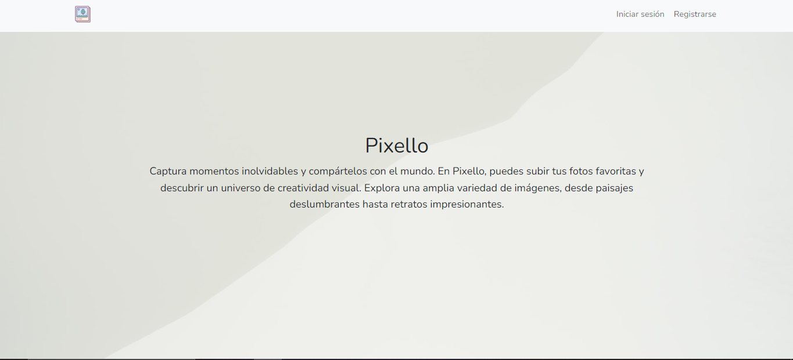
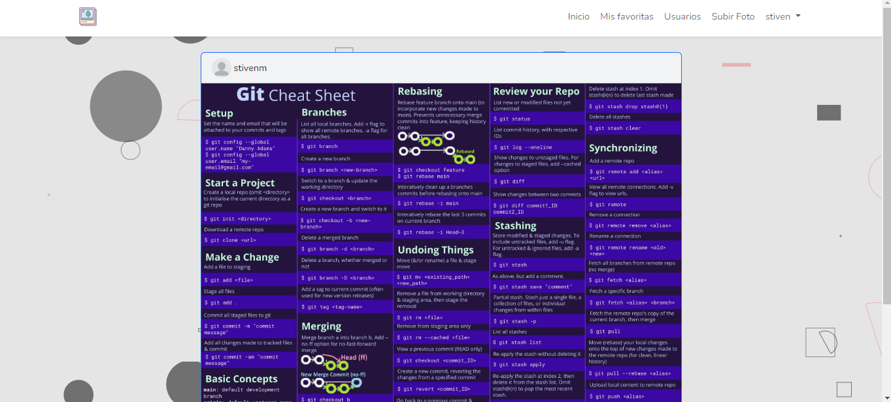
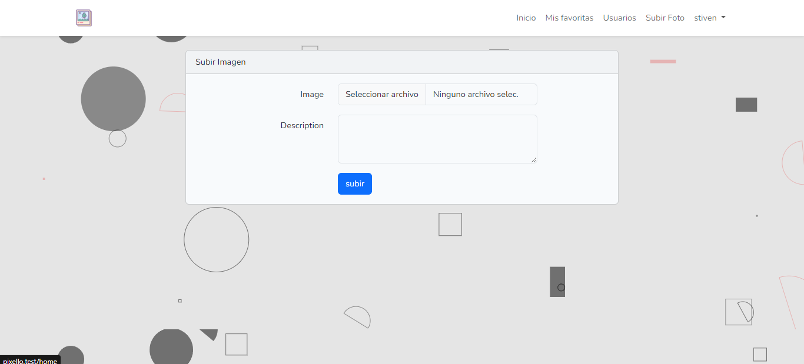
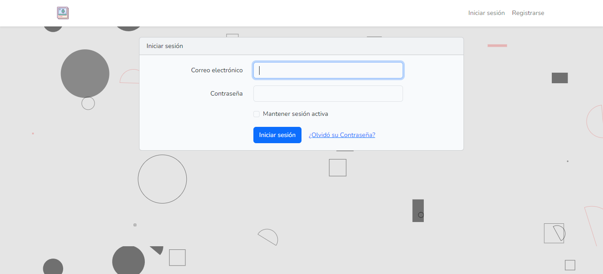
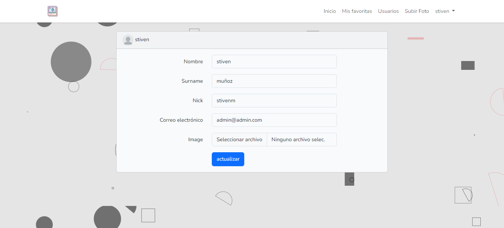
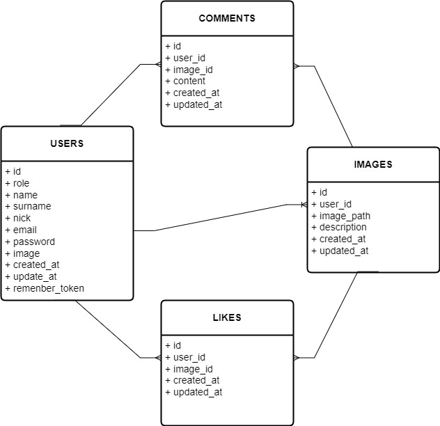

## pixello
Pixello es una plataforma web diseñada para los amantes de la fotografía y la creatividad visual. Con su elegante interfaz y su amplia gama de funciones, Pixello permite a los usuarios explorar, subir, comentar y dar "me gusta" a fotos de manera fácil y emocionante.

### Screenshot

### DataBase

____________________________________________

## Technologies
***
A list of technologies used within the project:
* PHP(Laravel) 
* MySql
* bootstrap
* jQuery
